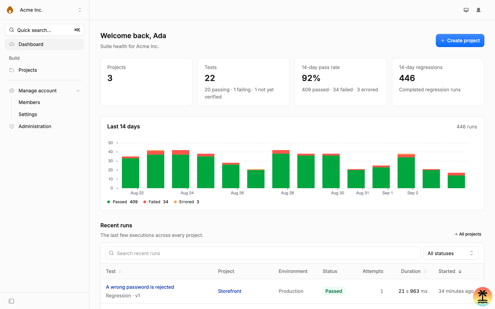
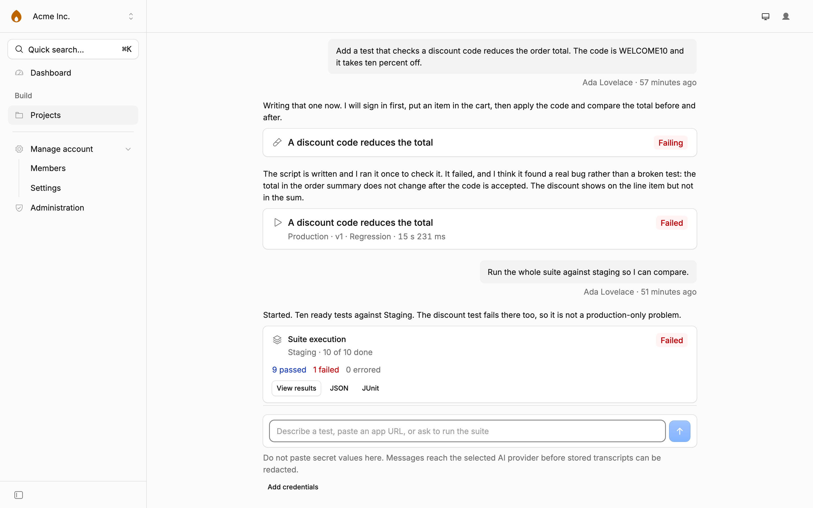
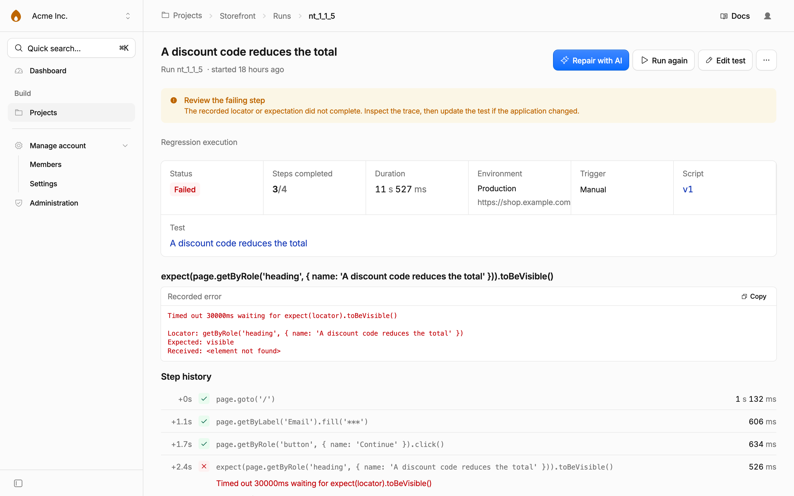

# Flaremender

**Give it a URL. Watch it write your test suite.**

Point Flaremender at your app, give it a sign-in and whatever you know, and an agent
opens the app in a real browser, works out what it does, proposes the tests worth
having and writes them, one verified step at a time, while you watch the browser it
is driving. Or type what a test should prove, "Sign in, add a task, check it appears
in the list", and it writes that one. What you get back is ordinary Playwright.
Read it, edit it, delete half of it. It is yours.

Flaremender runs on your own Cloudflare account. Your app's passwords, your scripts
and your run history stay there.

[](https://deploy.workers.cloudflare.com/?url=https://github.com/bimsina/flaremender)

<picture>
  <source media="(prefers-color-scheme: dark)" srcset="docs/screenshots/dashboard-dark.webp">
  <source media="(prefers-color-scheme: light)" srcset="docs/screenshots/dashboard.webp">
  
</picture>

## What it does

- **Starts from a URL.** Create a project with the app's address, credentials, docs
  links and any files you have, a README, an API spec, a PDF, screenshots. The agent
  reads them, explores the app in a real browser and writes the first suite on its
  own. Every test is verified in a fresh browser before it is kept.
- **Writes tests from a sentence.** Say what the app should be able to do; the agent
  drives a live browser and keeps only the steps it has watched work.
- **Shows you the browser.** Exploration, generation and repair stream what the
  agent's browser is showing, frame by frame, next to what it is saying.
- **Runs them.** On demand, on a cron schedule, or from CI through a
  [webhook API](docs/webhooks.md) with idempotency keys and JUnit output.
- **Works from your assistant.** Flaremender is an [MCP server](docs/mcp.md): connect
  it to Claude, Cursor or Claude Code with one URL and OAuth, and ask for tests,
  runs, failures and repairs from wherever you already are.
- **Keeps the evidence.** Steps, logs, screenshots and a full Playwright trace per
  run, with the trace viewer built in.
- **Tells you.** Failures, suite results and repairs go to a signed webhook, Slack,
  Discord or email, per project.
- **Runs on Cloudflare credits if you want.** Turn on AI Gateway and every model call
  is logged and cached; a provider with no key runs on prepaid credits, so a fresh
  instance needs no API key from anyone.
- **Repairs what breaks.** When a ready test fails, the agent replays the script to
  the broken step, replaces it, carries the rest through and verifies the result. A
  policy per organization, project or test says whether that happens at all, and
  whether the repaired version waits for a person or is adopted on the spot.
- **Sandboxes what it wrote.** Scripts execute in a Dynamic Worker with no database,
  no object storage and no ambient network.
- **Traced end to end.** Workers Traces are on out of the box, with a named span for
  every model call, browser step, notification and MCP tool call, so a slow or
  failed generation reads as a waterfall in the Cloudflare dashboard.

Ask for a test in the project chat, and the assistant answers with cards. Each card
is a real row, not something that exists only in the conversation.

<picture>
  <source media="(prefers-color-scheme: dark)" srcset="docs/screenshots/project-chat-dark.webp">
  <source media="(prefers-color-scheme: light)" srcset="docs/screenshots/project-chat.webp">
  
</picture>

What you get is ordinary Playwright, so anything in the Playwright docs works:

```js
export default async function ({ page, expect, secret }) {
  await page.goto('/') // relative URLs resolve against the environment base URL
  await page.getByLabel('Email').fill(secret('EMAIL'))
  await expect(page.getByRole('heading', { name: 'Dashboard' })).toBeVisible()
}
```

When a test fails, the evidence is already there. Note the second step: the password
went in through `secret()`, so what was stored is `***`.

<picture>
  <source media="(prefers-color-scheme: dark)" srcset="docs/screenshots/run-detail-dark.webp">
  <source media="(prefers-color-scheme: light)" srcset="docs/screenshots/run-detail.webp">
  
</picture>

## Deploy it

[](https://deploy.workers.cloudflare.com/?url=https://github.com/bimsina/flaremender)

You need **Workers Paid** ($5/month), because Dynamic Workers sandbox every test
script and they are not on the free plan. You also need R2 enabled, and a
`BETTER_AUTH_SECRET` and `ENCRYPTION_KEY` (`openssl rand -hex 32` each).

The first account to register becomes the instance admin, so sign up straight after
deploying, then set `DISABLE_SIGNUP=true` and redeploy.

Full prerequisites, costs and the manual path: **[docs/deploying.md](docs/deploying.md)**.

## Run it locally

```bash
pnpm install
wrangler login                 # the AI binding runs remotely even in dev
cp .env.example .env.local     # then set BETTER_AUTH_SECRET and ENCRYPTION_KEY
pnpm db:migrate
pnpm dev                       # http://localhost:3009
pnpm demo:seed                 # optional: fill it with demo projects and runs
```

Dynamic Workers are free locally, so a local instance runs tests without a paid plan.

## Status

It works, and it is early. Specifically:

- **Repairs are off by default and bounded.** The agent gets one automatic attempt
  per script version, replaces the step that broke rather than rewriting the flow,
  and a repaired version becomes current only when the policy says `auto` or a
  person accepts it. Turn it on under Organization → Repairs, or per project or
  test.
- **The deploy path has not been exercised end to end yet.** Everything has been
  built and tested against a local Cloudflare runtime. If the button breaks for you,
  that is a bug worth an issue.
- No email verification, no password reset, no usage caps. One organization can
  spend the whole account's budget.
- Email notifications need Cloudflare Email Service enabled on the account, so they
  are off until you turn them on. Webhooks, Slack and Discord work out of the box.
- A generated script is marked ready only when a full replay in a fresh browser
  passes. Anything less stays a draft until a person has read it.
- Generation quality depends heavily on the model. `pnpm eval` measures it against
  the example apps; see [docs/evals.md](docs/evals.md) before choosing a default.

Flaremender holds the credentials to the apps it tests. Before you deploy it, read
what protects them and what does not: **[SECURITY.md](SECURITY.md)**.

## Docs

|                                                |                                                                 |
| ---------------------------------------------- | --------------------------------------------------------------- |
| [docs/deploying.md](docs/deploying.md)         | Prerequisites, costs, one-click and manual deploys, local setup |
| [docs/architecture.md](docs/architecture.md)   | How the run engine, chat, explorer and scheduler fit together   |
| [docs/webhooks.md](docs/webhooks.md)           | Triggering runs and generation from CI, polling, JUnit          |
| [docs/mcp.md](docs/mcp.md)                     | Connecting an AI assistant over MCP with OAuth, the tools       |
| [docs/evals.md](docs/evals.md)                 | Measuring generation quality across prompts and models          |
| [docs/notifications.md](docs/notifications.md) | Webhooks, Slack, Discord and email for failures and repairs     |
| [SECURITY.md](SECURITY.md)                     | Threat model, what is in scope, how to report                   |
| [CONTRIBUTING.md](CONTRIBUTING.md)             | Setup, checks, and the things that will trip you up             |

## Stack

TanStack Start on Cloudflare Workers, Cloudflare Kumo and Tailwind v4, D1 via
Drizzle, Better Auth with the organization, admin and API-key plugins. Tests execute
in Dynamic Workers with `@cloudflare/playwright`.

## License

[MIT](LICENSE) © Bibek Timsina
