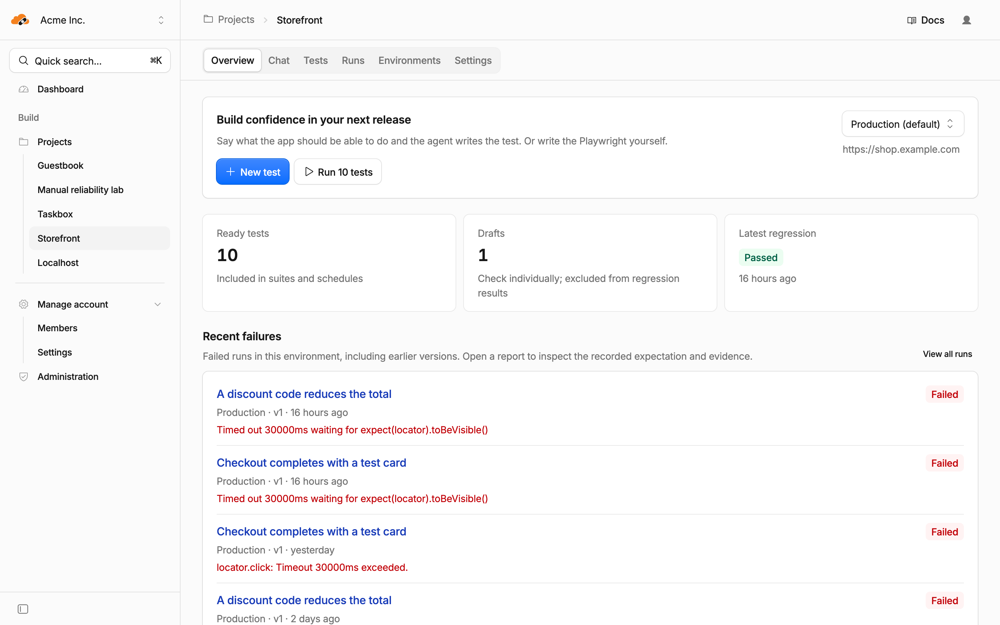
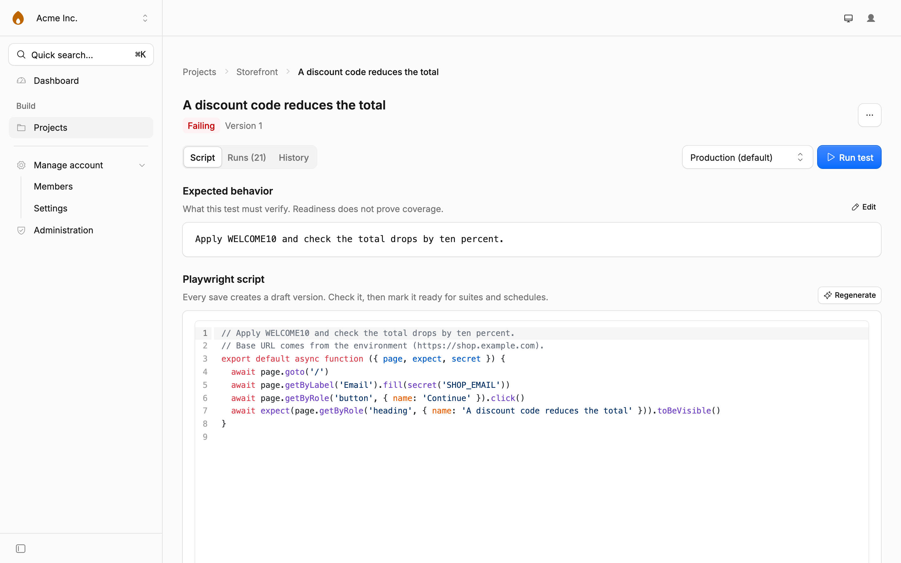
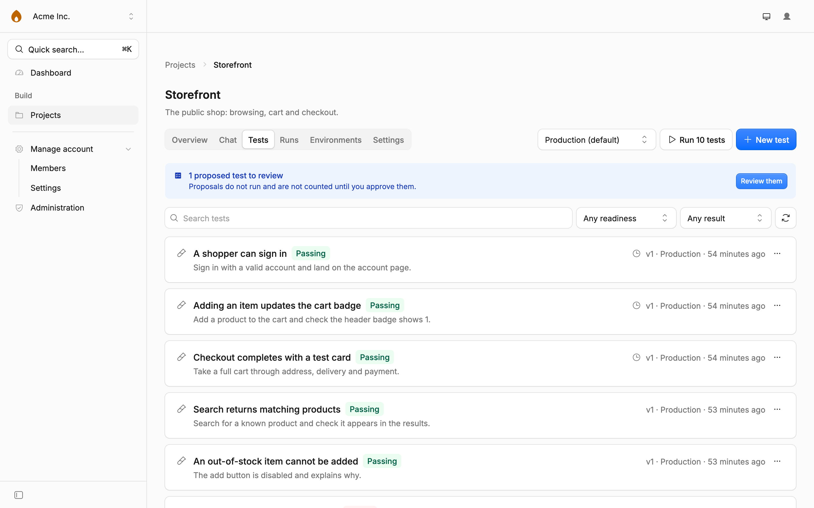
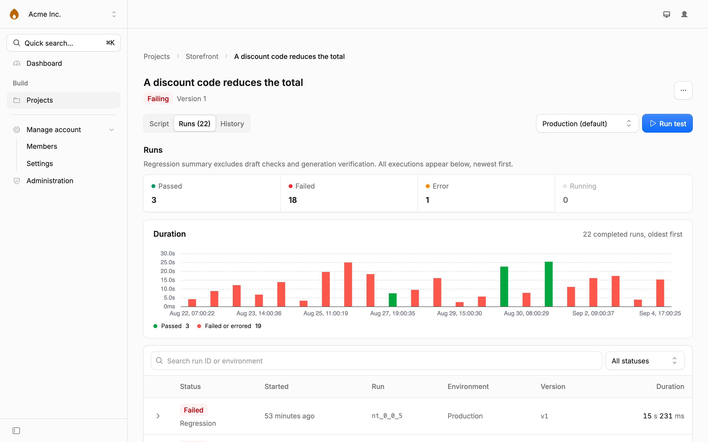
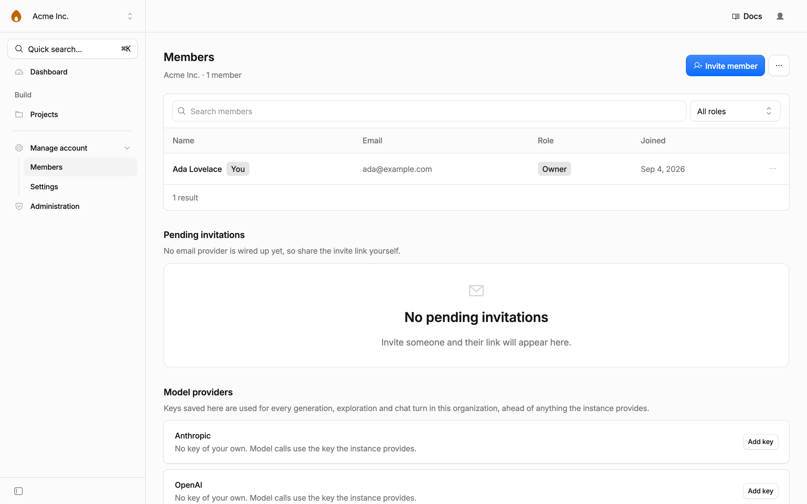
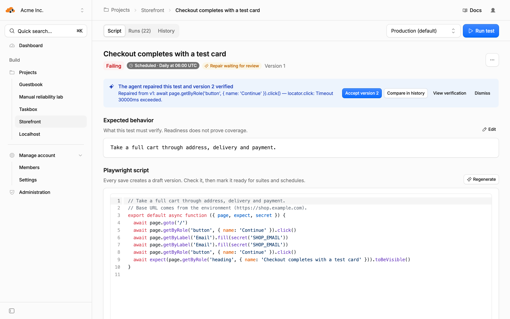

# How Flaremender works

The design, and why it is shaped this way. Read the [README](../README.md) first
if you only want to run it, and [docs/deploying.md](deploying.md) if you want to
deploy it.

Projects open on an overview: what is ready, what is drafted, and what failed last.

<picture>
  <source media="(prefers-color-scheme: dark)" srcset="screenshots/project-overview-dark.webp">
  <source media="(prefers-color-scheme: light)" srcset="screenshots/project-overview.webp">
  
</picture>

## The shape of the codebase

```
src/
  db/schema/      app.ts (projects, intents, runs) + auth.ts (generated)
  lib/            auth client, theme, query options, formatting
  server/         server functions, split by resource
    auth.ts       session middleware and the organization tenant boundary
    actions.ts    the shared core each of them (and the chat) calls
  engine/         the run engine. Workflow, harness, artifacts (see below)
  components/     shared UI
  routes/         _auth.* (signed out), _app.* (signed in), api/auth/$,
                  api/artifacts/$ (org-checked R2 reads)
```

Route groups carry the guards: `_auth` redirects signed-in users away,
`_app` requires a session and an organization, and `_app/admin` requires
`role: 'admin'`. Every organization-scoped server function goes through
`orgMiddleware`, which reads the organization id from the session and never
from the client.

### The run engine

Nothing executes in a request handler. `runIntent` inserts a `queued` run and
creates a `RunWorkflow` instance named after it, then returns; the Workflow
loads, executes and persists in three durable steps.

```
src/engine/
  contract.ts          result and event types shared by all three sides
  harness/runtime.ts   the Dynamic Worker entrypoint (bundled, not imported)
  harness/instrument.ts proxies that turn Playwright calls into step records
  runner/loader.ts     LOADER.load() wiring
  runner/browser.ts    browser lifecycle (compiled into the harness)
  runner/artifacts.ts  R2 writes under runs/{orgId}/{projectId}/{runId}/
  runner/scrub.ts      secret redaction
  run-workflow.ts      load → execute → persist
  suite-workflow.ts    a project's intents, run one after another
  schedule-dispatch.ts the minute tick: which intents are due
  retention.ts         the nightly sweep: what history to drop
```

A script runs inside a **Dynamic Worker**, an isolate built from two modules:
the pre-bundled harness and the saved script. Its only bindings are the browser,
the environment's decrypted variables and a base URL. No D1, no R2, no ambient
network, so an untrusted script has nothing to reach for. Artifacts travel back
to the host as bytes and are written to R2 from there.

Dynamic Workers require **Workers Paid** in production. They are free locally.

#### The harness bundle

`@cloudflare/playwright` cannot be imported by the host Worker and handed
across the loader boundary, because the loader takes module _source_. `pnpm harness`
(run automatically by `pnpm dev` and `pnpm build`) uses esbuild to bundle
`src/engine/harness/runtime.ts` plus all of Playwright into
`src/engine/harness/harness.generated.js`, which the host imports as a string.
The file is generated, not committed.

Two things about that build are load-bearing: `keepNames` must stay on, because
Playwright dispatches on `constructor.name`, and `./user-script.js` must stay
external, because that import is the slot the loader fills with the saved
script.

#### What a script looks like

<picture>
  <source media="(prefers-color-scheme: dark)" srcset="screenshots/test-detail-dark.webp">
  <source media="(prefers-color-scheme: light)" srcset="screenshots/test-detail.webp">
  
</picture>

```js
export default async function ({ page, expect, secret }) {
  await page.goto('/') // relative URLs resolve against the environment base URL
  await page.getByLabel('Email').fill(secret('EMAIL'))
  await expect(page.getByRole('heading', { name: 'Dashboard' })).toBeVisible()
}
```

`page` and `expect` are the real Playwright objects behind an instrumenting
proxy, so anything in the Playwright docs works. The proxy records each call as
a step. `secret()` reads an environment variable. Its value is replaced with `***`
in every log, label and error message before anything is stored, whether it appears
raw, URL-encoded or base64. Screenshots and traces can still _show_ a
secret: that is a visual leak no string replacement can fix.

### The project chat

Projects open on Overview, with environment context, ready tests, drafts and
regression results. Chat remains the primary place to create tests with AI:
the assistant carries requests out with tools that call the same
org-scoped functions in `src/server/actions.ts` the dialogs and buttons call, and
answers with **cards**. An intent, a live generation, a run, a suite, an
environment. Each links to the row it names. Nothing exists only inside
a conversation.

```
src/engine/
  chat/contract.ts   message parts, cards and the socket's event types
  chat/prompts.ts    the system prompt and the project's standing facts
  chat/tools.ts      the tool belt, wrapping server/actions.ts
  project-chat.ts    the ProjectChat Durable Object
src/server/
  actions.ts         what the product does, with nobody in particular asking
  chat.ts            listChatMessages + sendChatMessage
```

One `ProjectChat` Durable Object per project, addressed by the project id,
serialises turns (a second send while one is running is refused rather than
queued), runs the model turn (`streamText` with the tool belt), and streams
deltas, tool events and cards over hibernating WebSockets at
`/api/projects/:projectId/chat`. `src/server.ts` answers that upgrade the same
way it answers a run's: signed in, in an organization, and that organization owns
the project. Messages are persisted to D1 (`chat_message`, typed JSON parts) and
the history is what the model is shown next turn, with cards compacted to
one-line facts so it never has to invent an id.

**Credential lifting.** Paste a password into the chat and the assistant stores
it with `set_environment_variable`; from that moment the value is `***`
everywhere. The turn's redactor is rebuilt around it, and the message that carried
it is rewritten in D1 and on every open socket. The user's own message is
never broadcast, precisely because it is the one string that can hold a value the
redactor has not been told about yet; the sender renders their own copy, everyone
else sees the redacted row when the turn ends. The residual risk is inherent and
documented: the value reached the configured model provider once, in that message
and in the tool call that stored it.

### Explore, propose, generate

The chat's other half. Rather than being told what to test, the assistant can go
and find out: `explore_project` starts an **ExploreWorkflow** that drives a real
browser round the app, signing in with the stored credentials and reading any docs
URL it is given, then ends by proposing tests. Those proposals are **real intent
rows** in a new `'proposed'` status, rendered in the conversation as a checklist
you tick, edit and approve; approving starts a **BatchGenerateWorkflow** that
writes each script with the same turn loop a single Generate does.

```
src/engine/
  explore/prompts.ts    what the explorer is told, and the context it writes back
  explore/loop.ts       one explore turn: observe, navigate, interact, read_docs
  explore/docs.ts       fetch a docs page, strip it to text, cap it twice
  explore/steps.ts      claim the job, write the intents, post the plan
  explore-workflow.ts   the ExploreWorkflow
  generation/job.ts     one generation, shared by Generate and the batch
  batch-workflow.ts     an approved plan, one test at a time
  agent-transcript.ts   pruning stale page trees, shared by both loops
src/server/
  explore.ts            explore / approve / dismiss / edit the context
```

The explorer is the generator's opposite twin, and deliberately so. A generation
is building a file, so every fragment it keeps is permanently a line somebody
reads and wandering is a defect, hence `detectReplay` and the navigation-churn
guard. An exploration is building an _opinion_, so nothing it does is kept and
wandering is the job: it may navigate freely and abandon what it tries. Only
`rejectUnsafeInteraction` still applies, because `evaluate` and `force: true` are
how an agent breaks somebody's real app.

<picture>
  <source media="(prefers-color-scheme: dark)" srcset="screenshots/project-tests-dark.webp">
  <source media="(prefers-color-scheme: light)" srcset="screenshots/project-tests.webp">
  
</picture>

**`'proposed'` is not a test yet.** A proposed intent is excluded from "run all",
from the scheduler, and from every count that answers "how many tests does this
project have". `isAdoptedIntent` in `server/actions.ts` is the one filter all of
them wear. Approving flips it to `'draft'` and generates; dismissing deletes it,
because a rejected suggestion is not a state worth keeping and the next
exploration will propose it again if it was a good idea.

**Readiness is separate from outcome.** Manual saves and restores create draft
versions. Draft checks and generation verification are labeled and excluded
from suites, schedules and regression pass rates. Authors explicitly mark a
manual version ready; the assertion warning is only a hint about coverage.
A generated script becomes ready only when its verification replay passes;
an incomplete script, or one whose replay fails, stays a draft with the version
saved. Older runs keep their version and
environment snapshots and cannot certify a newly edited version.

Each test keeps its own run history and duration trend.

<picture>
  <source media="(prefers-color-scheme: dark)" srcset="screenshots/test-runs-dark.webp">
  <source media="(prefers-color-scheme: light)" srcset="screenshots/test-runs.webp">
  
</picture>

Authenticated JSON and JUnit exports are available from run and suite reports.
They use persisted results, exclude source code and environment variables, and
mark draft checks and generation verification as skipped JUnit cases.

External systems can trigger every ready test in a project or one ready test
through the versioned webhook API. Project API keys are created under Project
Settings and sent only in the `Authorization: Bearer` header. See the
[webhook API guide](webhooks.md) for request, polling, idempotency and
report examples.

See [the local reliability walkthrough](reliability-walkthrough.md) for
repeatable fixtures, verification commands and the remaining milestone gates.

<picture>
  <source media="(prefers-color-scheme: dark)" srcset="screenshots/organization-dark.webp">
  <source media="(prefers-color-scheme: light)" srcset="screenshots/organization.webp">
  
</picture>

**Which key a model call uses.** An organization's own provider key (Organization →
Model providers) wins, then the Worker secret, then the key saved in the admin
console. `src/server/provider-keys.ts` is the one place that order lives. Every
generation, exploration and chat turn records the tokens the provider reported, on
`generation_job` and `chat_message`, and the admin console sums them per
organization.

**`project.context`** is what the agents know about the app beyond any one
intent: the chat writes it with `set_project_context`, an exploration appends
what it found, and it is read into every chat turn and every generation's opening
message. Always redacted before it is written. A user pasting "log in with
ada@example.com / hunter2" is the _expected_ way this field gets its first
paragraph, and the value goes to an encrypted environment variable while the
sentence around it lands here with `***` in the middle. Editable on the project's
Settings tab, because a column that steers every future generation must not be
one only a machine can reach.

**Long jobs speak into the conversation.** An exploration finishes minutes after
the turn that started it ended, so the workflow posts its plan through
`ProjectChat.announce()`, which redacts what it is given and declines to broadcast
over a turn that is mid-answer, leaving the card in the transcript to re-read the
history when it sees the job finish.

### Repairs

When a regression run fails, `maybeQueueAutomaticRepair` in
`src/engine/repair/trigger.ts` decides whether the agent gets a go: the run must be
a `failed` regression of the test's current ready version, the effective heal
policy must not be `off`, nothing else may be generating for that test, and no
repair may already have been tried for that script version. A person can start
one from a failed run's page regardless of policy.

```
src/engine/
  repair/statements.ts  the saved script, split back into the statements it was assembled from
  repair/prompts.ts     the generation prompt plus "you are replacing one broken step"
  repair/steps.ts       load, replay, prepare the verification, apply the policy
  repair/trigger.ts     the automatic decision after a run persists
  repair-workflow.ts    load → session → replay → turns → verify → persist
src/server/
  heal-policy.ts        test → project → organization, default off
  repairs.ts            repair a run, accept or dismiss a repair, set the policies
```

A **RepairWorkflow** opens a browser session, replays the old script one statement at
a time and stops at the first one that fails. Everything before it is the verified
prefix, and the browser is exactly where the script broke. The same turn loop the
generator uses then runs with a repair-specific framing: replace the failing
statement, carry the remaining statements through, keep the assertions, change as
little as possible, and say so if the feature is gone rather than assert around it.
At most ten turns. The result is saved as a new agent-authored version and verified
in a fresh session, exactly like a generation.

<picture>
  <source media="(prefers-color-scheme: dark)" srcset="screenshots/test-repair-dark.webp">
  <source media="(prefers-color-scheme: light)" srcset="screenshots/test-repair.webp">
  
</picture>

The **heal policy** decides what happens to a repair that verified. `draft` parks it as
the test's `pendingRepairVersionId`, which the test page shows as a banner with
Accept and Dismiss; the failed run stays failed. `auto` makes it the current ready
version and marks the failed run `healed`, which counts as a pass everywhere a pass
is counted. Either way the failed run's attempt records `healApplied`: which job,
which version, what broke, and whether it was adopted. A repair that does not verify
is kept as a version in the history, never pointed at, and the job says why.

Policy is read from the test, then the project, then the organization, and the
organization's default is `off`. A manual repair under `off` or `draft` produces a
pending repair; under `auto` it is adopted.

### Notifications

Every run, suite and repair workflow ends with a `notify` step that never throws:
`src/engine/notifications/dispatch.ts` loads the project's enabled destinations
that subscribe to the event, builds the event once per dashboard origin (each
destination remembers the origin it was created from, because a Workflow has no
request to read one off), delivers, and writes a `notification_delivery` row with
the response or the error. Standalone runs fire `run.*`; runs inside a suite are
reported once by `suite.*` with the failures listed; draft checks and the
verification runs behind generation and repair never notify.

```
src/engine/notifications/
  events.ts    the event types and the payload shape every channel shares
  format.ts    one event rendered for Slack, Discord and email
  sign.ts      HMAC signature for plain webhooks
  dispatch.ts  fan-out, retries, the delivery log
src/server/notifications.ts   destinations, deliveries, Send test
```

Plain webhooks are signed with a per-destination secret shown once. Email goes
through Cloudflare Email Service behind an opt-in `send_email` binding; without
it, email deliveries are logged as failed with the reason. See
[docs/notifications.md](notifications.md).

### Schedules and retention

Two cron triggers reach `scheduled` in `src/server.ts`, told apart by the
expression that fired them:

- **`* * * * *`** marks every intent whose own five-field cron matches this UTC
  minute as due. Due intents are grouped per project and handed to one
  `SuiteWorkflow` against the project's default environment, with trigger
  `schedule` and no `createdBy`. A project whose suite is still running is
  skipped rather than stacked, and the suite's id is derived from the project
  and the minute (`srun_sch_<project>_<yyyymmddhhmm>`) so a replayed tick
  creates nothing.
- **`30 3 * * *`** keeps the newest N runs per intent (N from
  `instanceSettings.retentionRunsPerIntent`, default 50), deleting older runs,
  their attempts and their R2 prefixes. At most 500 objects per night; the rest
  waits for the next one.

Schedules are read in UTC. The grammar covers `*`, numbers, lists, ranges and
steps, plus the POSIX rule that a restricted day-of-month and day-of-week are ORed.
It is documented on `src/lib/cron.ts`, which is the single parser behind the editor,
the badge and the dispatcher.

Cron triggers do not fire on their own under `pnpm dev`. Fire one by hand:

```bash
# a schedule tick for a specific UTC minute
curl "http://localhost:3009/cdn-cgi/handler/scheduled?cron=*%20*%20*%20*%20*&time=$(node -e 'console.log(Math.floor(Date.now()/60000)*60000)')"

# the nightly retention sweep
curl "http://localhost:3009/cdn-cgi/handler/scheduled?cron=30%203%20*%20*%20*"
```

## Theming

Kumo resolves light and dark through CSS `light-dark()`, keyed on `data-mode`
on `<html>`. Never use Tailwind's `dark:` variant. The preference (light, dark
or system) is stored in a cookie and in `localStorage`, and applied by a
blocking script in `<head>` so there is no flash before hydration.

## Commands

```bash
pnpm dev             # build the harness, then dev server on :3009
pnpm build           # build the harness, then production build
pnpm harness         # rebuild src/engine/harness/harness.generated.js only
pnpm deploy          # build, migrate the remote database, deploy
pnpm lint            # oxlint
pnpm format          # oxfmt
pnpm typecheck       # tsc --noEmit
pnpm test            # node --test
pnpm eval            # generate the eval scenarios against the example apps and score them
                     # (repair is not in the eval set yet)
pnpm generate-routes # regenerate routeTree.gen.ts
pnpm demo:seed       # fill a local instance with demo projects, tests and runs
pnpm screenshots     # regenerate the images in this README
```
