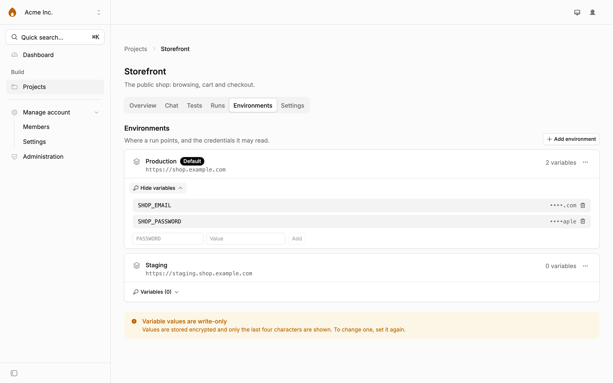

# Deploying Flaremender

Everything you need to get Flaremender running, on Cloudflare or on your laptop.
For what it is and why, see the [README](../README.md).

## Deploying to Cloudflare

### What your Cloudflare account needs

One requirement rules out the Workers Free plan. The rest is setup.

| Requirement                    | Why                                               | Plan                                                                                                                                                        |
| ------------------------------ | ------------------------------------------------- | ----------------------------------------------------------------------------------------------------------------------------------------------------------- |
| **Workers Paid** ($5/month)    | Dynamic Workers, which sandbox every test script  | **Required.** A Free-plan instance installs, deploys and signs you in, then cannot run a single test                                                        |
| **R2 enabled**                 | screenshots, traces and logs                      | Enable once in the dashboard under R2                                                                                                                       |
| **An LLM provider**            | generation, exploration and chat                  | Workers AI is the default and needs no key; Anthropic, OpenAI or Google produce noticeably better scripts. Keys can be set per instance or per organization |
| AI Gateway                     | logging, caching and credits for every model call | Optional. Set a gateway id under Administration → Settings; a provider with no key then runs on prepaid AI Gateway credits                                  |
| Browser Rendering              | every test runs in a real browser                 | Free and Paid                                                                                                                                               |
| Workflows, Durable Objects, D1 | orchestration, live updates, storage              | Free and Paid                                                                                                                                               |
| KV                             | OAuth grants for the [MCP server](mcp.md)         | Free and Paid                                                                                                                                               |
| Workers Logs and Traces        | every run, turn and model call, as a waterfall    | On by default in `wrangler.jsonc`; included on Paid up to 20 million events a month                                                                         |
| Email Service                  | email notifications                               | Optional. Webhooks, Slack and Discord need nothing; see [docs/notifications.md](notifications.md)                                                           |

### What it costs

Everything runs on your account and bills to you.

|                        | Included                                 | Beyond that                                                                                             |
| ---------------------- | ---------------------------------------- | ------------------------------------------------------------------------------------------------------- |
| Workers Paid           | the plan itself                          | $5/month                                                                                                |
| Browser Rendering      | 10 min/day on Free; 10 hrs/month on Paid | $0.09 per browser-hour                                                                                  |
| Dynamic Workers        | 1,000 unique workers/month               | $0.002 each per day (waived during the open beta)                                                       |
| Workers AI             | 10,000 Neurons/day                       | $0.011 per 1,000 Neurons                                                                                |
| Bring your own LLM key | nothing                                  | billed directly by Anthropic, OpenAI or Google                                                          |
| AI Gateway credits     | nothing                                  | prepaid; the gateway shows tokens and cost per call, and per organization when each has its own gateway |

Generation and exploration are the expensive parts. Each drives a real browser for
minutes and can make up to 96 model calls (24 turns of up to 4 tool steps each).
Watch the first few runs before you put
anything on a schedule.

### One click

[](https://deploy.workers.cloudflare.com/?url=https://github.com/bimsina/flaremender)

The button forks the repository, creates the D1 database, R2 bucket, KV namespace,
Durable Objects and Workers AI binding, and asks for the secrets below. Workflows, the browser
binding and the Worker Loader need no setup. They come up with the deploy.

You will be asked for:

| Secret                                                    | Required | Value                                                                                     |
| --------------------------------------------------------- | -------- | ----------------------------------------------------------------------------------------- |
| `BETTER_AUTH_SECRET`                                      | yes      | `openssl rand -hex 32`                                                                    |
| `ENCRYPTION_KEY`                                          | yes      | `openssl rand -hex 32`. **Set it once.** Changing it makes every stored secret unreadable |
| `ANTHROPIC_API_KEY` / `OPENAI_API_KEY` / `GOOGLE_API_KEY` | no       | can be added from the admin console later                                                 |
| `DISABLE_SIGNUP`                                          | no       | `true` closes public registration. Set it once you have created your account              |

The deployment works out its own origin from each request, so there is nothing
to set after the first deploy. If you later put it behind a proxy that rewrites
the `Host` header, pin the public origin with `wrangler secret put BETTER_AUTH_URL`.

### By hand

```bash
git clone https://github.com/bimsina/flaremender.git
cd flaremender
pnpm install
wrangler login

wrangler d1 create flaremender           # paste the id it prints into wrangler.jsonc
wrangler r2 bucket create flaremender-artifacts

wrangler secret put BETTER_AUTH_SECRET   # openssl rand -hex 32
wrangler secret put ENCRYPTION_KEY       # openssl rand -hex 32

pnpm deploy                              # builds, applies remote migrations, deploys
```

Open the URL the deploy printed and sign up. The Worker reads its origin from
the request, so no URL needs to be configured.

### Environments and credentials

A project's environments hold the base URL a run points at and the credentials it may
read. Values are write-only: encrypted at rest, and only the last four characters are
ever shown again.

<picture>
  <source media="(prefers-color-scheme: dark)" srcset="screenshots/project-environments-dark.webp">
  <source media="(prefers-color-scheme: light)" srcset="screenshots/project-environments.webp">
  
</picture>

### First sign-in

Open the deployment and create an account. **The first account to register becomes
the instance admin**, so do it now rather than later. Onboarding then walks you
through creating an organization and choosing a model.

Then close registration. Until you do, anyone who finds the URL can sign up and
spend your Cloudflare budget. Set `DISABLE_SIGNUP=true` in `wrangler.jsonc` (or as a
Worker secret) and redeploy. Your account keeps working, and so does anyone holding a
pending invitation, so you can still add teammates from Organization settings.

## Getting started locally

```bash
pnpm install
wrangler login                    # the AI binding runs remotely even in dev
cp .env.example .env.local        # then set BETTER_AUTH_SECRET and ENCRYPTION_KEY
pnpm db:migrate                   # without this, signing up fails
pnpm dev
```

The app runs at http://localhost:3009 against the local D1 database under
`.wrangler/`. Sign up and you are the admin.

Dynamic Workers are free locally, so a local instance runs tests without a paid
plan. Workers AI is not. `wrangler.jsonc` marks the `AI` binding `remote`, so model
calls in local development reach your real account and are billed. Set an Anthropic,
OpenAI or Google key in the admin console to avoid that.

### Seeing it with data in it

A fresh instance is empty, which makes it hard to tell what anything does. The demo
seed fills it in:

```bash
pnpm demo:seed   # three projects, 25 tests, 14 days of runs. No model calls, no cost.
```

It creates the demo account for you if it does not exist. `pnpm screenshots`
regenerates the images in this README from that data.

### Database

Schema lives in `src/db/schema/`. `auth.ts` is generated. Never edit it by hand.

```bash
pnpm auth:generate   # regenerate src/db/schema/auth.ts from auth.config.ts
pnpm db:migrate      # apply additive migrations to local D1 only
pnpm db:studio       # browse the local database
```

`auth.config.ts` exists only for code generation; the runtime configuration is
`src/lib/auth.ts`. Keep their plugin lists in sync or the generated schema will
drift from what the app needs.

Use migrations for an existing database. The baseline also adopts databases
created with the original schema without deleting their history. Do not run
`db:push` before migrations: pushing the new columns first would bypass the
readiness and historical verification backfills.
